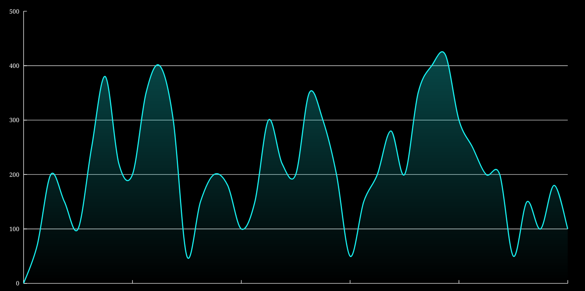

# Vertigo Graphs

Blocks for building graphs in [vertigo](https://crates.io/crates/vertigo).

[](https://crates.io/crates/vertigo-graphs)
[](https://docs.rs/vertigo-graphs)

[](https://deps.rs/crate/vertigo-graphs/0.1.0)
[](https://github.com/vertigo-web/vertigo-graphs/actions/workflows/pipeline.yaml)
[](https://crates.io/crates/vertigo-graphs)

See [Changelog](https://github.com/vertigo-web/vertigo-graphs/blob/master/CHANGES.md) for recent features.

## Example

Dependencies:

```toml
vertigo = "0.13"
vertigo-graphs = "0.1"
```



([Source](storybook/src/tab_6_fill_gradient.rs))

Example 1:

```rust
use vertigo::{Computed, DomNode, dom, main};
use vertigo_graphs::{Graph, GraphData};

#[main]
fn app() -> DomNode {
    let data = GraphData {
        label: Computed::from(|_| "Graph".to_string()),
        scale_x: Computed::from(|_| 100.0),
        scale_y: Computed::from(|_| 100.0),
        points: Computed::from(|_| {
            vec![
                (0.0, 0.0),
                (20.0, 30.0),
                (40.0, 10.0),
                (60.0, 50.0),
                (80.0, 30.0),
                (100.0, 70.0),
            ]
        }),
    };

    dom! {
        <html>
            <head />
            <body>
                <Graph data={data} />
            </body>
        </html>
    }
}
```

Example 2:

```rust
use vertigo::{Computed, DomNode, dom};
use vertigo_graphs::{ChartContainer, GraphData, Grid, Legend, Line, Tooltip, XAxis, YAxis};

pub fn render() -> DomNode {
    let data = GraphData {
        label: Computed::from(|_| "Built from blocks".to_string()),
        scale_x: Computed::from(|_| 500.0),
        scale_y: Computed::from(|_| 500.0),
        points: Computed::from(move |_| {
            vec![
                (0.0, 0.0),
                (100.0, 200.0),
                (200.0, 100.0),
                (300.0, 300.0),
                (400.0, 200.0),
                (500.0, 400.0),
            ]
        }),
    };

    dom! {
        <ChartContainer {&data} padding_x={} background={}>
            <Grid {&data} kind={} />
            <XAxis {&data} stroke={} />
            <YAxis {&data} stroke={} values={} />
            <Line {&data} color={} kind={} />
            <Legend {&data} />
            <Tooltip {&data} />
        </ChartContainer>
    }
}
```

## Storybook App

### Prepare

Install vertigo-cli:

* `cargo install vertigo-cli`

### Run

Build and run storybook in watch mode:

* `vertigo watch vertigo-graphs-storybook`

Eventually terminal will let you know that app is available under `http://localhost:4444/`

If you want to play around with the code, the browser will automatically refresh after the project has been re-compiled.
